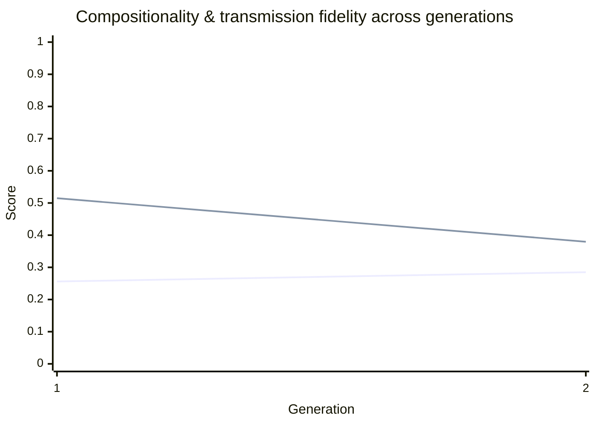

# 🧬 Traditio Generation Report

_Iterated language transmission experiment: each generation only sees a sampled subset of the previous generation's language and must reconstruct the rest, testing what regularities survive a chain of learners._

   

> [!NOTE]
> ➡️ Compositionality is holding roughly steady (+0.0290) this generation.

## Generation 2 (claude-haiku-4-5-20251001)

Generated: 2026-08-13T12:48:27.149Z

| Metric | Value | What it means |
|---|---|---|
| Compositionality | 0.2849 (▲ +0.0290) | Correlation between how different two meanings are and how different their word forms are. Closer to 1 = a systematic, rule-like language; closer to 0 = arbitrary forms. |
| Transmission fidelity (overall) | 0.3796 (▼ -0.1353) | Mean normalized edit distance between this generation's forms and the previous generation's, across all meanings (0 = identical, 1 = completely different). Lower = more faithful transmission. |
| — in-sample | 0.0000 | Same measure, restricted to meanings this generation actually saw during training. |
| — held-out | 0.6326 | Same measure for meanings NOT shown to this generation — it had to infer these forms. Larger divergence here is expected. |
| Compression ratio | 0.4189 (▼ -0.0431) | gzip size of the full lexicon divided by its raw size. Lower = more internal redundancy/structure in the forms. |
| Unique forms | 185 / 200 | Distinct word forms produced. Fewer than 200 means some meanings collapsed onto the same form. |

## 👀 Watch the language evolve

A fixed set of meanings, tracked every generation, so you can see actual forms drift:

| Meaning | Gen 1 form | Gen 2 form | |
|---|---|---|---|
| wolf sees bird (past) | `waleni` | `towicha` | 🔄 drifted |
| wolf fears bird (nonpast) | `wanitu` | `wanitu` | ✅ unchanged |
| bird chases child (past) | `bochato` | `bochato` | ✅ unchanged |
| bird finds child (nonpast) | `tijikawi` | `bashilun` | 🔄 drifted |
| child eats stone (past) | `lili` | `chiseti` | 🔄 drifted |
| stone sees child (nonpast) | `howenu` | `howenu` | ✅ unchanged |
| stone fears river (past) | `somelo` | `somelu` | 🔄 drifted |
| river chases stone (nonpast) | `lune` | `lune` | ✅ unchanged |

## 📈 Trend

## History across generations

| Gen | Compositionality | Transmission Fidelity | Compression | Unique Forms |
|---|---|---|---|---|
| 1 | 0.2559 | 0.5148 | 0.4620 | 197/200 |
| 2 | 0.2849 | 0.3796 | 0.4189 | 185/200 |
