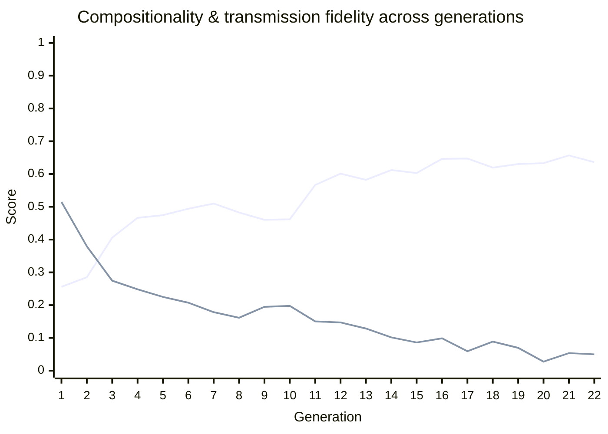

# 🧬 Traditio Generation Report

_Iterated language transmission experiment: each generation only sees a sampled subset of the previous generation's language and must reconstruct the rest, testing what regularities survive a chain of learners._

   

> [!NOTE]
> ➡️ Compositionality is holding roughly steady (-0.0206) this generation.

## Generation 22 (claude-haiku-4-5-20251001)

Generated: 2026-08-20T00:32:18.548Z

| Metric | Value | What it means |
|---|---|---|
| Compositionality | 0.6361 (▼ -0.0206) | Correlation between how different two meanings are and how different their word forms are. Closer to 1 = a systematic, rule-like language; closer to 0 = arbitrary forms. |
| Transmission fidelity (overall) | 0.0500 (▼ -0.0036) | Mean normalized edit distance between this generation's forms and the previous generation's, across all meanings (0 = identical, 1 = completely different). Lower = more faithful transmission. |
| — in-sample | 0.0065 | Same measure, restricted to meanings this generation actually saw during training. |
| — held-out | 0.0790 | Same measure for meanings NOT shown to this generation — it had to infer these forms. Larger divergence here is expected. |
| Compression ratio | 0.1934 (→ steady) | gzip size of the full lexicon divided by its raw size. Lower = more internal redundancy/structure in the forms. |
| Unique forms | 125 / 200 | Distinct word forms produced. Fewer than 200 means some meanings collapsed onto the same form. |

## 👀 Watch the language evolve

A fixed set of meanings, tracked every generation, so you can see actual forms drift:

| Meaning | Gen 21 form | Gen 22 form | |
|---|---|---|---|
| wolf sees bird (past) | `towjemelo` | `towjememelo` | 🔄 drifted |
| wolf fears bird (nonpast) | `wajemelen` | `wajemelen` | ✅ unchanged |
| bird chases child (past) | `bojmemelo` | `bojmemelo` | ✅ unchanged |
| bird finds child (nonpast) | `bojimelen` | `bojimelen` | ✅ unchanged |
| child eats stone (past) | `chisemelo` | `chisemelo` | ✅ unchanged |
| stone sees child (nonpast) | `simelen` | `simemelen` | 🔄 drifted |
| stone fears river (past) | `solemelo` | `solemelo` | ✅ unchanged |
| river chases stone (nonpast) | `rusemelen` | `rusemelen` | ✅ unchanged |

## 📈 Trend

## History across generations

| Gen | Compositionality | Transmission Fidelity | Compression | Unique Forms |
|---|---|---|---|---|
| 1 | 0.2559 | 0.5148 | 0.4620 | 197/200 |
| 2 | 0.2849 | 0.3796 | 0.4189 | 185/200 |
| 3 | 0.4060 | 0.2746 | 0.3776 | 183/200 |
| 4 | 0.4663 | 0.2481 | 0.3557 | 178/200 |
| 5 | 0.4745 | 0.2251 | 0.3544 | 187/200 |
| 6 | 0.4941 | 0.2074 | 0.3510 | 197/200 |
| 7 | 0.5099 | 0.1785 | 0.3388 | 181/200 |
| 8 | 0.4826 | 0.1615 | 0.3126 | 164/200 |
| 9 | 0.4603 | 0.1949 | 0.3194 | 184/200 |
| 10 | 0.4619 | 0.1977 | 0.3076 | 176/200 |
| 11 | 0.5665 | 0.1504 | 0.3196 | 175/200 |
| 12 | 0.6011 | 0.1472 | 0.2931 | 166/200 |
| 13 | 0.5822 | 0.1286 | 0.2746 | 164/200 |
| 14 | 0.6121 | 0.1016 | 0.2793 | 172/200 |
| 15 | 0.6029 | 0.0861 | 0.2531 | 157/200 |
| 16 | 0.6464 | 0.0987 | 0.2310 | 142/200 |
| 17 | 0.6473 | 0.0594 | 0.2235 | 140/200 |
| 18 | 0.6195 | 0.0888 | 0.2259 | 138/200 |
| 19 | 0.6304 | 0.0697 | 0.2001 | 125/200 |
| 20 | 0.6332 | 0.0276 | 0.1935 | 118/200 |
| 21 | 0.6566 | 0.0536 | 0.1938 | 122/200 |
| 22 | 0.6361 | 0.0500 | 0.1934 | 125/200 |
